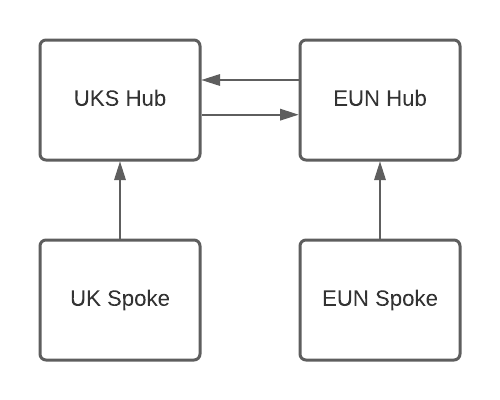

# MultiRegion Peering with AzFW
This is an example of two alternate region hubs, each with a spoke, that are all peered together via Azure Firewall. This was an exercise in trying to determine why spoke to spoke couldn't communicate for a client. The long and short of it is that the User Define Routes need to be scoped down in order for them to take precedence over Azure "default" routes. See: https://docs.microsoft.com/en-us/azure/virtual-network/virtual-networks-udr-overview#how-azure-selects-a-route

